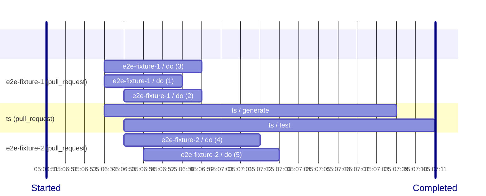

# trace-workflows-action [](https://github.com/int128/trace-workflows-action/actions/workflows/ts.yaml)

This is an action to export the trace of GitHub Actions workflows to OpenTelemetry.

## Purpose

You can analyze the timeline of workflows and jobs in a single trace.
This is useful for a mono-repository (monorepo) with many workflows.

Here is an example of the trace.



You can export the trace to OpenTelemetry such as Datadog APM.


## Getting Started

This workflow exports the trace of the workflows triggered by a pull request.

```yaml
name: trace-workflows

on:
  pull_request:

jobs:
  trace-workflows:
    runs-on: ubuntu-latest
    timeout-minutes: 30
    steps:
      # Wait for all workflows to be completed.
      - uses: int128/wait-for-workflows-action@v1
      # Export the trace.
      - uses: int128/trace-workflows-action@v0
        env:
          # For dry-run, write the trace to the standard output.
          OTEL_TRACES_EXPORTER: console
          # For production, export the trace to OpenTelemetry Collector.
          OTEL_EXPORTER_OTLP_ENDPOINT: http://opentelemetry-collector:4318
```

## Trace structure

This action exports the following spans:

1. Event
2. Workflow
3. Job

The span contains the following common attributes:

- `service.name`: `github-actions`.
- `service.version`: The target commit SHA.
- `host.name`: Typically `github.com`. Determined from the GitHub server URL.
- `deployment.environment.name`
  - If a pull request, `pr-` prefix and the number.
  - Otherwise, the target branch name or tag name.
- `github.repository`: The repository name.
- `github.ref`: The target branch name.
- `github.sha`: The target commit SHA.
- `github.actor`: The actor who triggered the workflow.
- `github.event.name`: The event name.
- `github.run_attempt`: Attempt number of the workflow run. 1 for the first run.

### 1. Event span

The span name is in the form of `owner/repo:event_name:ref`.
This is the root span of the trace.

The span contains the following attributes:

- `operation.name`: `event`.
- `url.full`: GitHub URL to the pull request or commit.

### 2. Workflow span

The span name is the workflow name.
If the workflow run is failed, cancelled or timed out, the span is marked as ERROR.

The span contains the following attributes:

- `operation.name`: `workflow`.
- `github.workflow.name`: The workflow name.
- `github.workflow.conclusion`: The conclusion of the workflow run.
- `github.workflow.status`: The status of the workflow run.
- `url.full`: GitHub URL to the workflow run.

### 3. Job span

The span name is the job name.
If the job is failed, cancelled or timed out, the span is marked as ERROR.

The span contains the following attributes:

- `operation.name`: `job`.
- `github.job.name`: The job name.
- `github.job.conclusion`: The conclusion of the job run.
- `github.job.status`: The status of the job run.
- `url.full`: GitHub URL to the job.

## Specification

This action fetches the workflows run on the following commit:

- If this action is called on `workflow_run` event, it fetches the workflows run on the target commit.
- If this action is called on `pull_request` event, it fetches the workflows run on the head commit of the pull request.
- Otherwise, it fetches the workflows run on the current commit.

### Inputs

| Name    | Default value  | Description  |
| ------- | -------------- | ------------ |
| `token` | `github.token` | GitHub token |

### Environment variables

This action accepts the environment variables for the OpenTelemetry SDK.
See https://opentelemetry.io/docs/languages/sdk-configuration/ for details.

### Outputs

| Name       | Description                                        |
| ---------- | -------------------------------------------------- |
| `timeline` | The mermaid Gantt chart of the workflows and jobs. |
